# Hi there, I'm Rayane! 👋

  

<h3 align="center">Computer Science Student from France 🇫🇷</h3>

  

 

 
🔭 **3rd year Computer Science Student**

🌱 Learning **Machine Learning** & **Full-Stack Development**

👯 Open to collaborate on **innovative projects** & **hackathons**

---

## 🛠️ Languages & Frameworks & Tools

    
     
    
     
    

   
  <code></code>
  <code></code>
  <code></code>
  <code></code>

---

## ⚡ GitHub Stats

  
  

   
  

---

## 📈 Activity Graph

  

  
<table>
<tr>
<td width="50%">

</td>
<td width="50%">

</td>
</tr>
<tr>
<td width="50%">

</td>
<td width="50%">

</td>
</tr>
</table>

<h4>
  <a href="https://github.com/Rayane0001?tab=repositories" title="Show Repositories">🔎 Show More Repositories 🔍</a>
</h4>

---

## 🎮 Interactive Tetris Game!

**Play a quick game while browsing my profile!**

*Click START to play! Use A/D to move, S to drop, and click to rotate pieces.*

---

## 📫 Let's Connect!

**🎯 Looking for:** Summer Internship (worldwide) & Apprenticeship in France (Paris/Lille)

**✨ Let's build something amazing together!**

---

  

