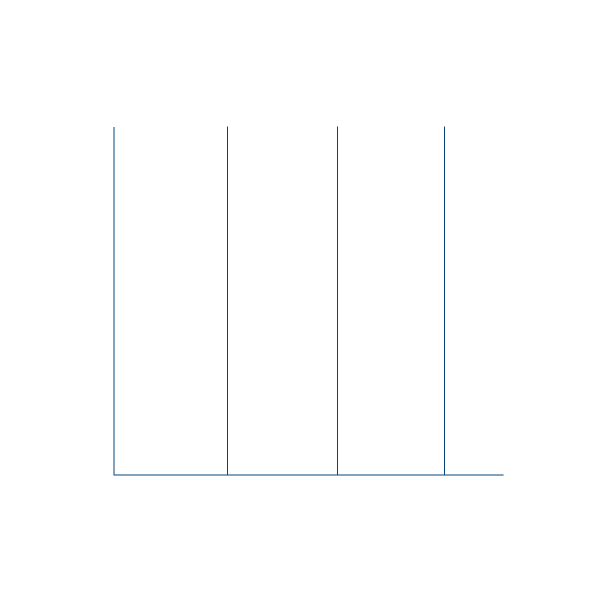

# Hi there, I'm Rayane! 

  

<h3 align="center">🎓 Computer Science Student @ Université de Lille 🇫🇷</h3>

  

 

 
🚀 **Passionate about:** ML/Data/AI • Software Engineering • Competitive Programming

🌟 **Open to:** Innovative Projects • Hackathons • Collaboration

---

## Tech Stack & Tools 

### 💻 Languages

### 🚀 Frameworks & Libraries

### 🤖 AI/ML & Data Science

 
<code></code>
<code></code>

### 🗄️ Databases

### 🛠️ DevOps & Tools

---

## GitHub Stats 

  
  

   
  

---

## 📈 Activity Graph

  

---

## Check Some Repositories ! 

  
<table>
<tr>
<td width="50%">

</td>
<td width="50%">

</td>
</tr>
<tr>
<td width="50%">

</td>
<td width="50%">

</td>
</tr>
</table>

<h4>
  <a href="https://github.com/Rayane0001?tab=repositories" title="Show Repositories">🔎 Show More Repositories 🔍</a>
</h4>

---

## 📫 Let's Connect!

**🎯 Looking for:** Summer Internship (worldwide) & Apprenticeship in France (Paris/Lille)

**✨ Let's build something amazing together!**

  

